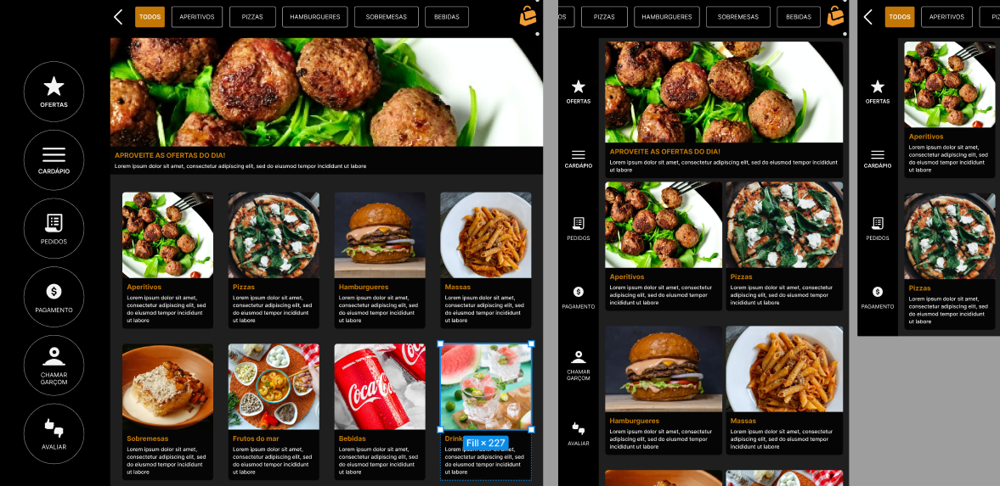

# QR Code System Team7 - Cardápio Online
Project developed for the discipline of Software Product: Analysis, Specification, Project & Implementation at [Impacta Technology](https://www.impacta.edu.br/).



## Setup

- Create a new `.env` file in the project root
- Inside set the following variables:

  ```bash
  DATABASE_URL="mysql://<user>:<password>@<host>:<port>/<database>?schema=<schema>"
  ```

## Installation

Before running the app, you need to install the dependencies.

```bash
$ npm install
```

## Running migrations

Before running the app, you need to run the migrations to create the database schema.

```bash
# development mode
$ npm run migrate:dev

# production mode
$ npm run migrate:prod
```

## Running the app

To run the app, you need to run both the web and server apps.

```bash
# development mode
$ npm run dev:web
$ npm run dev:server

# production mode
$ npm run prod:server
```

## Running the app with Docker

To run the app with Docker, you need to run the following commands.

```bash
# development mode
$ docker-compose up

# production mode
$ docker-compose -f docker-compose.prod.yml up
```

## Tech Stack

The following tools were used in the construction of the project:

- [TypeScript](https://www.typescriptlang.org/)
- [Node.js](https://nodejs.org/en/)
- [Nest.js](https://nestjs.com/)
- [Next.js](https://nextjs.org/)
- [React.js](https://react.dev/)
- [ReactIcons](https://react-icons.github.io/react-icons/)
- [TailwindCSS](https://tailwindcss.com/)
- [Prisma](https://www.prisma.io/)
- [MySQL](https://www.mysql.com/)
- [Prettier](https://prettier.io/)
- [ESLint](https://eslint.org/)
- [Husky](https://typicode.github.io/husky/#/)
- [Docker](https://www.docker.com/)
- [Docker Compose](https://docs.docker.com/compose/)
- [GitHub Issues](https://docs.github.com/en/issues)
- [GitHub Projects](https://docs.github.com/en/issues/organizing-your-work-with-project-boards/managing-project-boards/about-project-boards)