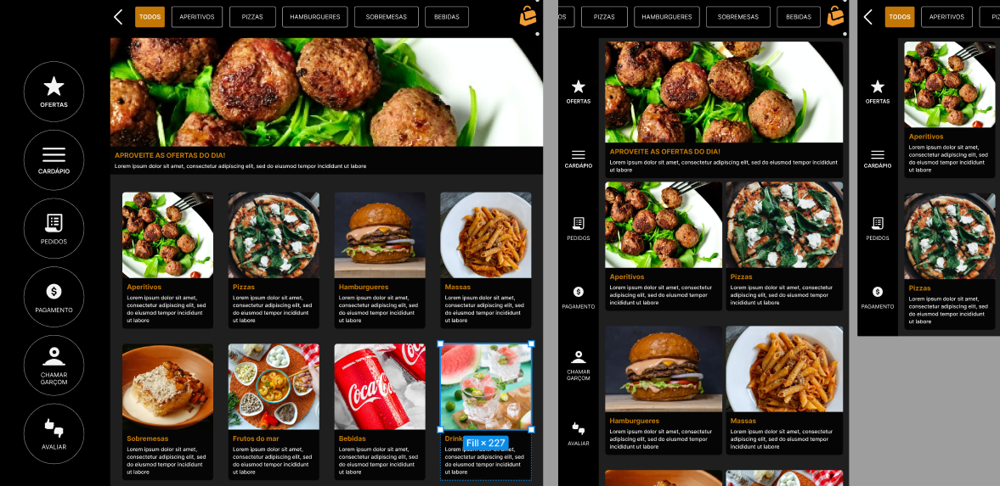

# QR Code System Team7 - Cardápio Online
Project developed for the discipline of Software Product: Analysis, Specification, Project & Implementation at [Impacta Technology](https://www.impacta.edu.br/).



## Setup

- Create a new `.env` file in the project `server` root
- Inside set the following variables:

  ```bash
  DATABASE_URL="mysql://<user>:<password>@<host>:<port>/<database>?schema=<schema>"
  ```

## Server

### Installation

Before running the server, you need to install the dependencies in the `server` folder.

```bash
$ npm install
```

### Running migrations

Before running the app, you need to run the migrations to create the database schema.

```bash
# development mode
$ npm run migrate:dev

# production mode
$ npm run migrate:prod
```

## Web

### Installation

Before running the app, you need to install the dependencies in the `web` folder.

```bash
$ npm install
```

## Running the app

To run the app, you need to run following command inside the `server` folder:

```bash
# development mode
$ npm run start:dev
```

To run the app, you need to run following command inside the `web` folder:

```bash
# development mode
$ npm run dev
```


## Tech Stack

The following tools were used in the construction of the project:

- [TypeScript](https://www.typescriptlang.org/)
- [Node.js](https://nodejs.org/en/)
- [Nest.js](https://nestjs.com/)
- [Next.js](https://nextjs.org/)
- [React.js](https://react.dev/)
- [ReactIcons](https://react-icons.github.io/react-icons/)
- [TailwindCSS](https://tailwindcss.com/)
- [Prisma](https://www.prisma.io/)
- [MySQL](https://www.mysql.com/)
- [GitHub Issues](https://docs.github.com/en/issues)
- [GitHub Projects](https://docs.github.com/en/issues/organizing-your-work-with-project-boards/managing-project-boards/about-project-boards)